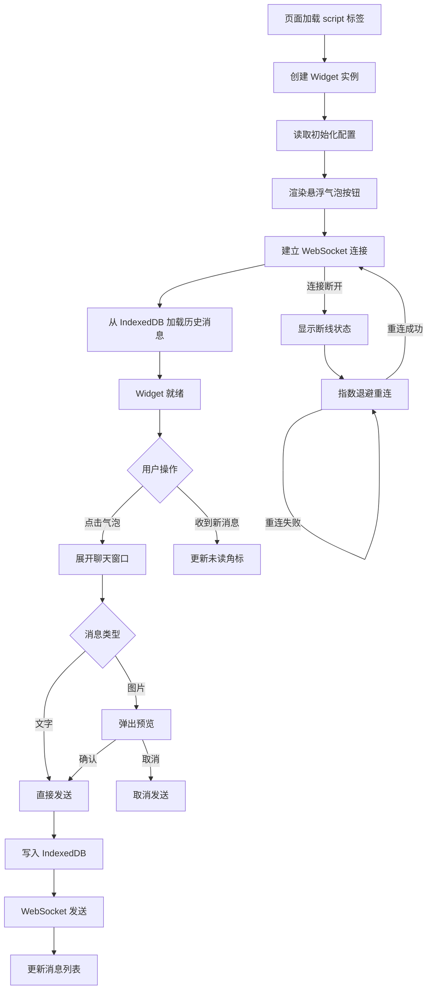

## 1. 产品概述

可嵌入任意网站的客服聊天 Widget，通过一行 `<script>` 标签即可集成。为网站访客提供实时客服沟通能力，支持文字与图片消息，消息持久化存储，断线自动重连。

- **核心价值**：零门槛集成，一行代码即可拥有专业客服聊天功能
- **目标用户**：需要在网站中嵌入在线客服的中小型企业与开发者

## 2. 核心功能

### 2.1 用户角色

| 角色 | 说明 |
|------|------|
| 网站访客 | 通过 Widget 与客服实时沟通 |
| 客服人员 | 通过服务端 WebSocket 接入，回复访客消息 |

### 2.2 功能模块

1. **Widget 悬浮入口**：悬浮气泡按钮、未读消息角标、可配置位置与主题
2. **聊天窗口**：消息列表、文字输入发送、图片选择发送、图片预览、连接状态提示、欢迎语展示

### 2.3 页面详情

| 页面名称 | 模块名称 | 功能描述 |
|----------|----------|----------|
| Widget 悬浮入口 | 气泡按钮 | 固定于页面右下角（可配置左/右），点击展开/收起聊天窗口，带点击与 hover 动效 |
| Widget 悬浮入口 | 未读角标 | 气泡按钮右上角显示红色数字角标，展示未读消息数量，点击后清零 |
| 聊天窗口 | 头部栏 | 显示客服名称与连接状态指示灯（已连接/断线/重连中），关闭按钮 |
| 聊天窗口 | 欢迎语 | 窗口首次打开时展示配置的欢迎语，以客服消息样式渲染 |
| 聊天窗口 | 消息列表 | 区分访客/客服消息，文字消息气泡，图片消息缩略图（可点击放大），自动滚动到底部 |
| 聊天窗口 | 图片预览 | 图片发送前弹出预览弹窗，支持确认发送或取消 |
| 聊天窗口 | 输入区域 | 文本输入框 + 发送按钮 + 图片选择按钮，回车发送文字 |

## 3. 核心流程

1. **初始化流程**：页面加载 `<script>` → 创建 Widget 实例 → 读取配置 → 渲染气泡按钮 → 建立 WebSocket 连接 → 从 IndexedDB 加载历史消息
2. **发送消息流程**：用户输入文字/选择图片 → 图片类型触发预览 → 确认发送 → 写入 IndexedDB → 通过 WebSocket 发送 → 更新消息列表
3. **接收消息流程**：WebSocket 收到消息 → 写入 IndexedDB → 更新未读计数（窗口收起时）→ 渲染消息气泡
4. **断线重连流程**：WebSocket 断开 → 显示断线状态 → 指数退避重连 → 重连成功后同步离线消息

## 4. 用户界面设计

### 4.1 设计风格

- **主色调**：可配置主题色（默认 `#4F46E5` 靛蓝色），搭配白/浅灰背景
- **次要色**：访客消息气泡使用主题色浅色变体，客服消息气泡使用白色
- **圆角风格**：大圆角（12px），现代感强
- **字体**：系统默认字体栈，确保各平台一致性
- **动效**：气泡按钮脉冲动画、窗口展开/收起过渡动画、消息出现滑入动画
- **图标**：使用内联 SVG 图标，无需外部依赖

### 4.2 页面设计概述

| 页面名称 | 模块名称 | UI 元素 |
|----------|----------|---------|
| 悬浮入口 | 气泡按钮 | 60px 圆形按钮，主题色背景，白色聊天图标，右下角固定定位，box-shadow 阴影，hover 放大动效 |
| 悬浮入口 | 未读角标 | 18px 红色圆形，白色数字，绝对定位于气泡右上角，数字变化时缩放动画 |
| 聊天窗口 | 整体容器 | 380×520px 圆角矩形，白色背景，阴影，从气泡位置弹出动画 |
| 聊天窗口 | 头部栏 | 主题色背景，白色文字，左侧状态圆点（绿/黄/红），右侧关闭按钮 |
| 聊天窗口 | 消息列表 | 访客消息右对齐主题色气泡，客服消息左对齐白色气泡，时间戳小字显示 |
| 聊天窗口 | 图片预览 | 半透明遮罩层，居中展示图片，底部确认/取消按钮 |
| 聊天窗口 | 输入区域 | 浅灰背景，文本输入框 + 图片按钮 + 发送按钮，发送按钮主题色 |

### 4.3 响应式

- 桌面端：聊天窗口固定 380×520px
- 移动端（<480px）：聊天窗口全屏展示，气泡按钮缩小为 48px
- 所有尺寸均支持触摸操作

### 4.4 Shadow DOM 隔离

- Widget 使用 Shadow DOM 封装，避免与宿主页面样式冲突
- 所有样式均定义在 Shadow DOM 内部
