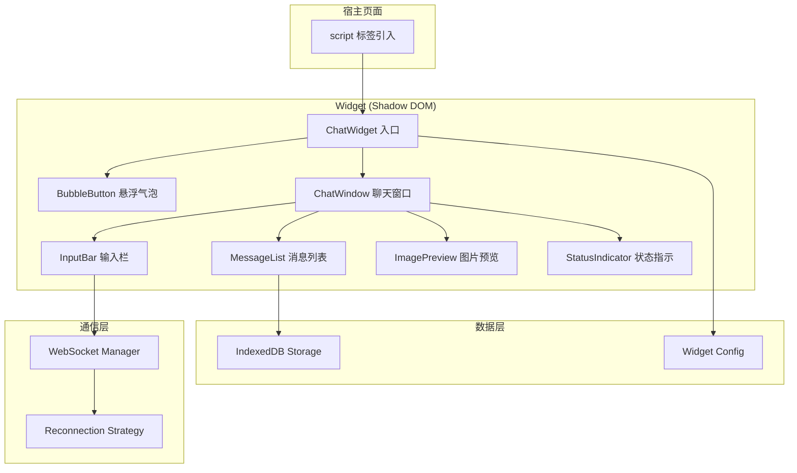
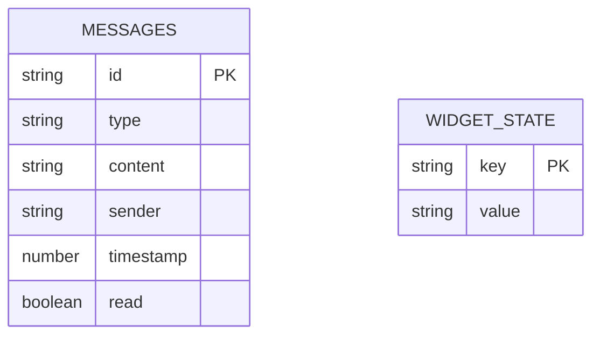

## 1. 架构设计



## 2. 技术说明

- **前端**：React@18 + TypeScript + Vite（Library 模式构建为单一 IIFE 文件）
- **样式方案**：CSS-in-JS（内联样式 + CSS 变量），全部封装在 Shadow DOM 中，零外部依赖
- **状态管理**：Zustand
- **数据存储**：IndexedDB（通过 idb 库封装）
- **实时通信**：原生 WebSocket + 指数退避重连策略
- **构建产物**：单一 `chat-widget.js` 文件（IIFE 格式），内联所有样式与图标

## 3. 路由定义

本项目为嵌入式 Widget，无路由概念。状态切换通过组件内部状态管理：

| 状态 | 说明 |
|------|------|
| collapsed | 聊天窗口收起，仅显示气泡按钮 |
| expanded | 聊天窗口展开，显示完整聊天界面 |

## 4. API 定义

### 4.1 初始化配置

```typescript
interface WidgetConfig {
  wsUrl: string;
  themeColor?: string;
  position?: 'left' | 'right';
  welcomeMessage?: string;
  agentName?: string;
}
```

### 4.2 WebSocket 消息协议

```typescript
interface ChatMessage {
  id: string;
  type: 'text' | 'image';
  content: string;
  sender: 'visitor' | 'agent';
  timestamp: number;
}

interface WSIncomingMessage {
  action: 'message' | 'agent_joined' | 'agent_left';
  payload: ChatMessage;
}

interface WSOutgoingMessage {
  action: 'send_message';
  payload: ChatMessage;
}
```

### 4.3 全局初始化接口

```typescript
interface ChatWidgetAPI {
  init: (config: WidgetConfig) => void;
  destroy: () => void;
  open: () => void;
  close: () => void;
}
```

宿主页面使用方式：

```html
<script src="https://cdn.example.com/chat-widget.js"></script>
<script>
  ChatWidget.init({
    wsUrl: 'wss://your-server.com/ws',
    themeColor: '#4F46E5',
    position: 'right',
    welcomeMessage: '你好！有什么可以帮助你的吗？',
    agentName: '在线客服'
  });
</script>
```

## 5. 数据模型

### 5.1 IndexedDB 数据模型



### 5.2 IndexedDB Schema

- **数据库名称**：`chat_widget_db`
- **版本**：1
- **对象仓库**：
  - `messages`：存储所有聊天消息
    - 主键：`id`
    - 索引：`timestamp`（按时间排序查询）、`sender`（按发送者筛选）
  - `widget_state`：存储 Widget 状态
    - 主键：`key`
    - 存储：未读消息数、窗口展开状态等

## 6. 项目结构

```
src/
├── index.tsx                  # Widget 入口，挂载 Shadow DOM
├── components/
│   ├── BubbleButton.tsx       # 悬浮气泡按钮
│   ├── ChatWindow.tsx         # 聊天窗口主容器
│   ├── MessageList.tsx        # 消息列表
│   ├── MessageBubble.tsx      # 单条消息气泡
│   ├── InputBar.tsx           # 输入栏（文字+图片）
│   ├── ImagePreview.tsx       # 图片预览弹窗
│   └── StatusIndicator.tsx    # 连接状态指示
├── hooks/
│   ├── useWebSocket.ts        # WebSocket 连接与重连
│   ├── useMessages.ts         # 消息收发与状态
│   └── useIndexedDB.ts        # IndexedDB 读写封装
├── store/
│   └── widgetStore.ts         # Zustand 全局状态
├── utils/
│   ├── idb.ts                 # IndexedDB 操作封装
│   └── config.ts              # 配置解析与默认值
└── types.ts                   # TypeScript 类型定义
```

## 7. 构建配置

Vite 配置为 Library 模式，输出单一 IIFE 文件：

- **入口**：`src/index.tsx`
- **输出格式**：IIFE
- **全局变量名**：`ChatWidget`
- **外部化**：无（所有依赖均打包进产物）
- **CSS**：内联到 JS 中，运行时注入 Shadow DOM
